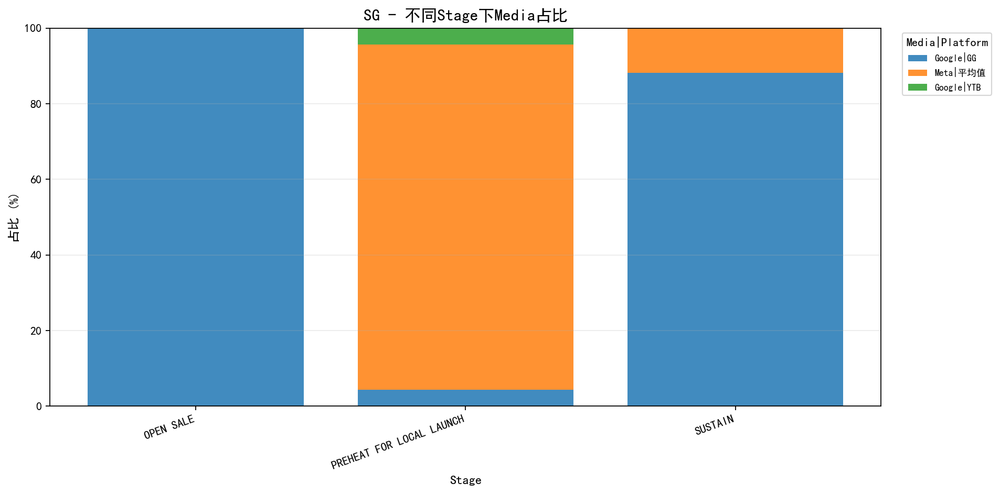

# 测试报告
**测试用例**: brief_stage_media_stablility_稳定性-StageMedia双大小关系匹配
**UUID**: 1dafc480-67c3-4a08-be45-1206d2ae
**Job ID**: 1774498022_1_8ff3c85f
**生成时间**: 2026-03-26 14:54:42

---
## 测试配置
| 配置项 | 值 |
|--------|-----|
| KPI目标达成率 | 80% |
| 区域预算目标达成率 | 90% |
| 区域KPI目标达成率 | 80% |
| 阶段预算误差范围 | 20% |
| 营销漏斗预算误差范围 | 15% |
| 媒体预算误差范围 | 5% |
| AdFormatKPI目标达成率 | 80% |
| AdFormat预算目标达成率 | 80% |

---
### KPI优先级
| 优先级 | KPI |
|--------|-----|
| 1 | Impression |
| 2 | VideoViews |
| 3 | Clicks |

---
### 模块优先级
| 优先级 | 模块 |
|--------|-----|
| 1 | stage |
| 2 | media |
| 3 | kpiInfo |
| 4 | marketingFunnel |
| 5 | mediaMarketingFunnelFormat |
| 6 | mediaMarketingFunnelFormatBudgetConfig |

---
## 全局 KPI 达成情况
**达成率**: 2/3 (66.67%)

**判断逻辑**: 当"必须达成"为"是"时，要求实际值 ≥ 目标值；当"必须达成"为"否"时，满足达成率条件即可。

| KPI | 优先级 | 必须达成 | 实际值 | 目标值 | 达成率 | 状态 |
|-----|--------|----------|--------|--------|--------|------|
| Impression | 1 | 否 | 1,511,053,306 | 60,941,850 | 2480.00% | ✓ 达成 |
| VideoViews | 2 | 否 | 0 | 881,914 | 0.00% | ✗ 未达成 |
| Clicks | 4 | 否 | 43,076,373 | 655,130 | 6575.00% | ✓ 达成 |

---
## 区域预算达成情况
**匹配类型**: None
**达成率**: 0/0 (N/A)

---
## 区域 KPI 达成情况

**判断逻辑**: 当"必须达成"为"是"时，要求实际值 ≥ 目标值；当"必须达成"为"否"时，满足达成率条件即可。
### 汇总
| 区域 | 达成数/总数 | 达成率 |
|------|-------------|--------|

### 详细信息

---
## 阶段预算满足情况
**总体满足率**: 3/3 (100.0%)
**SG 顺序一致性**: ✓ 一致

| 区域 | 阶段 | 目标排名 | 实际排名 | 目标预算 | 实际预算 | 目标比例 | 实际比例 | 状态 |
|------|------|----------|----------|----------|----------|----------|----------|------|
| SG | OPEN SALE | 1 | 1 | 2,593,800 | 2,593,800 | 43.23% | 43.23% | ✓ 满足 |
| SG | SUSTAIN | 2 | 2 | 2,012,400 | 2,012,400 | 33.54% | 33.54% | ✓ 满足 |
| SG | PREHEAT FOR LOCAL LAUNCH | 3 | 3 | 1,393,800 | 1,393,800 | 23.23% | 23.23% | ✓ 满足 |

---
## 营销漏斗预算满足情况
**总体满足率**: 2/2 (100.0%)

| 区域 | 满足数/总数 | 满足率 |
|------|-------------|--------|
| SG | 2/2 | 100.0% |

---
## 媒体预算满足情况
**总体满足率**: 3/3 (100.0%)

| 区域 | 满足数/总数 | 满足率 |
|------|-------------|--------|
| SG | 3/3 | 100.0% |

### 详细信息
#### SG
**顺序一致性**: ✓ 一致

| 媒体 | 平台 | 目标排名 | 实际排名 | 目标预算 | 实际预算 | 目标比例 | 实际比例 | 状态 |
|------|------|----------|----------|----------|----------|----------|----------|------|
| Google | GG | 1 | 1 | 4,189,200 | 4,429,200 | 69.82% | 73.82% | ✓ 满足 |
| Meta | 平均值 | 2 | 2 | 1,510,800 | 1,510,800 | 25.18% | 25.18% | ✓ 满足 |
| Google | YTB | 3 | 3 | 300,000 | 60,000 | 5.00% | 1.00% | ✓ 满足 |

---
## 不同Stage下Media占比统计
说明：按 `国家 -> stage -> media|platform` 聚合预算，并计算每个 stage 内的占比。

### SG

| Stage | Media | Platform | 预算 | 占比 |
|-------|-------|----------|------|------|
| OPEN SALE | Google | GG | 2,593,800.00 | 100.00% |
| PREHEAT FOR LOCAL LAUNCH | Meta | 平均值 | 1,273,800.00 | 91.39% |
| PREHEAT FOR LOCAL LAUNCH | Google | GG | 60,000.00 | 4.30% |
| PREHEAT FOR LOCAL LAUNCH | Google | YTB | 60,000.00 | 4.30% |
| SUSTAIN | Google | GG | 1,775,400.00 | 88.22% |
| SUSTAIN | Meta | 平均值 | 237,000.00 | 11.78% |

---
## adformat KPI 达成情况
**总体达成率**: 0/0 (N/A)

| 区域 | 达成数/总数 | 达成率 |
|------|-------------|--------|
| SG | 0/12 | 0.0% |

### 详细信息
#### SG
| 媒体 | 平台 | 漏斗 | 广告格式 | 创意 | KPI | 优先级 | 必须达成 | 实际值 | 目标值 | 达成率 | 状态 |
|------|------|------|----------|------|-----|--------|----------|--------|--------|--------|------|

---
## adformat预算满足情况
**总体满足率**: 0/0 (N/A)

| 区域 | 满足数/总数 | 满足率 |
|------|-------------|--------|

### 详细信息

---
## adformat预算非0检查

**说明**: 当 `allow_zero_budget=False` 时，检查每个推广区域下每个 AdFormat 是否都分配了预算。按 (媒体, 平台, 广告格式) 聚合求和预算，只要预算 > 0 即视为已分配。
**总体满足率**: 4/4 (100.0%)

| 区域 | 满足数/总数 | 满足率 |
|------|-------------|--------|
| SG | 4/4 | 100.0% |

✓ 所有 AdFormat 都已分配预算

---
## 总体结论

### 各维度达成情况汇总

| 维度 | 达成情况 | 达成率 |
|------|----------|--------|
| 全局 KPI | 2/3 | 66.7% |
| 区域预算 | 0/0 | 0.0% |
| 区域 KPI | 0/0 | 0.0% |
| 阶段预算 | 3/3 | 100.0% |
| 营销漏斗预算 | 2/2 | 100.0% |
| 媒体预算 | 3/3 | 100.0% |
| adformat kpi | 0/12 | 0.0% |
| adformat预算 | 0/0 | 0.0% |
| adformat预算非0 | 4/4 | 100.0% |
