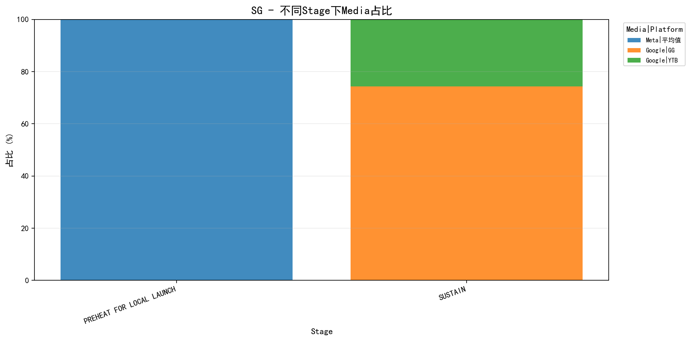

# 测试报告
**测试用例**: relaxation_trigger
**UUID**: 025701dd-b441-4d30-9210-4a707a31
**Job ID**: 1774605371_1_bc3a9856
**生成时间**: 2026-03-27 17:56:47

---
## 测试配置
| 配置项 | 值 |
|--------|-----|
| KPI目标达成率 | 95% |
| 区域预算目标达成率 | 90% |
| 区域KPI目标达成率 | 80% |
| 阶段预算误差范围 | 20% |
| 营销漏斗预算误差范围 | 15% |
| 媒体预算误差范围 | 5% |
| AdFormatKPI目标达成率 | 95% |
| AdFormat预算目标达成率 | 95% |

---
### KPI优先级
| 优先级 | KPI |
|--------|-----|
| 1 | Impression |
| 2 | Clicks |
| 3 | VideoViews |

---
### 模块优先级
| 优先级 | 模块 |
|--------|-----|
| 1 | kpiInfo |
| 2 | media |
| 3 | marketingFunnel |
| 4 | stage |
| 5 | mediaMarketingFunnelFormat |
| 6 | mediaMarketingFunnelFormatBudgetConfig |

---
## 全局 KPI 达成情况
**达成率**: 2/3 (66.67%)

**判断逻辑**: 当"必须达成"为"是"时，要求实际值 ≥ 目标值；当"必须达成"为"否"时，满足达成率条件即可。

| KPI | 优先级 | 必须达成 | 实际值 | 目标值 | 达成率 | 状态 |
|-----|--------|----------|--------|--------|--------|------|
| Impression | 1 | 是 | 923,569,438 | 120,000,000 | 770.00% | ✓ 达成 |
| Clicks | 2 | 是 | 23,681,319 | 1,200,000 | 1973.00% | ✓ 达成 |
| VideoViews | 3 | 是 | 0 | 12,000,000 | 0.00% | ✗ 未达成 |

---
## 区域预算达成情况
**匹配类型**: None
**达成率**: 0/0 (N/A)

---
## 区域 KPI 达成情况

**判断逻辑**: 当"必须达成"为"是"时，要求实际值 ≥ 目标值；当"必须达成"为"否"时，满足达成率条件即可。
### 汇总
| 区域 | 达成数/总数 | 达成率 |
|------|-------------|--------|

### 详细信息

---
## 阶段预算满足情况
**总体满足率**: 1/3 (33.3%)

| 区域 | 满足数/总数 | 满足率 |
|------|-------------|--------|
| SG | 1/3 | 33.3% |

---
## 营销漏斗预算满足情况
**总体满足率**: 2/2 (100.0%)

| 区域 | 满足数/总数 | 满足率 |
|------|-------------|--------|
| SG | 2/2 | 100.0% |

---
## 媒体预算满足情况
**总体满足率**: 1/3 (33.3%)

| 区域 | 满足数/总数 | 满足率 |
|------|-------------|--------|
| SG | 1/3 | 33.3% |

### 详细信息
#### SG
| 媒体 | 平台 | 目标预算 | 实际预算 | 目标比例 | 实际比例 | 误差 | 状态 |
|------|------|----------|----------|----------|----------|------|------|
| Google | GG | 3,120,000 | 3,120,000 | 52.00% | 52.00% | 0% | ✓ 满足 |
| Google | YTB | 480,000 | 1,080,000 | 8.00% | 18.00% | 10% | ✗ 不满足 |
| Meta | 平均值 | 2,400,000 | 1,800,000 | 40.00% | 30.00% | 10% | ✗ 不满足 |

---
## 不同Stage下Media占比统计
说明：按 `国家 -> stage -> media|platform` 聚合预算，并计算每个 stage 内的占比。

### SG

| Stage | Media | Platform | 预算 | 占比 |
|-------|-------|----------|------|------|
| PREHEAT FOR LOCAL LAUNCH | Meta | 平均值 | 1,800,000.00 | 100.00% |
| SUSTAIN | Google | GG | 3,120,000.00 | 74.29% |
| SUSTAIN | Google | YTB | 1,080,000.00 | 25.71% |

---
## adformat KPI 达成情况
**总体达成率**: 8/12 (66.7%)

| 区域 | 达成数/总数 | 达成率 |
|------|-------------|--------|
| SG | 8/12 | 66.7% |

### 详细信息
#### SG
| 媒体 | 平台 | 漏斗 | 广告格式 | 创意 | KPI | 优先级 | 必须达成 | 实际值 | 目标值 | 达成率 | 状态 |
|------|------|------|----------|------|-----|--------|----------|--------|--------|--------|------|
| Google | GG | Traffic | Demand Gen | Image | Impression | 1 | 是 | 162,684,292 | 40,000,000 | 407.00% | ✓ 达成 |
| Google | GG | Traffic | Demand Gen | Image | Clicks | 2 | 是 | 5,714,286 | 900,000 | 635.00% | ✓ 达成 |
| Google | GG | Traffic | Demand Gen | Image | VideoViews | 3 | 是 | 0 | 1,500,000 | 0.00% | ✗ 未达成 |
| Google | GG | Traffic | Search | Text | Impression | 1 | 是 | 44,717,095 | 40,000,000 | 112.00% | ✓ 达成 |
| Google | GG | Traffic | Search | Text | Clicks | 2 | 是 | 4,395,604 | 900,000 | 488.00% | ✓ 达成 |
| Google | GG | Traffic | Search | Text | VideoViews | 3 | 是 | 0 | 1,500,000 | 0.00% | ✗ 未达成 |
| Google | YTB | Awareness | VRC 2.0 | Video | Impression | 1 | 是 | 100,016,670 | 40,000,000 | 250.00% | ✓ 达成 |
| Google | YTB | Awareness | VRC 2.0 | Video | Clicks | 2 | 是 | 3,956,044 | 300,000 | 1319.00% | ✓ 达成 |
| Google | YTB | Awareness | VRC 2.0 | Video | VideoViews | 3 | 是 | 0 | 9,000,000 | 0.00% | ✗ 未达成 |
| Meta | 平均值 | Traffic | Image&Video Link Ads | Image&Video | Impression | 1 | 是 | 616,151,381 | 80,000,000 | 770.00% | ✓ 达成 |
| Meta | 平均值 | Traffic | Image&Video Link Ads | Image&Video | Clicks | 2 | 是 | 9,615,385 | 300,000 | 3205.00% | ✓ 达成 |
| Meta | 平均值 | Traffic | Image&Video Link Ads | Image&Video | VideoViews | 3 | 是 | 0 | 1,500,000 | 0.00% | ✗ 未达成 |

---
## adformat预算满足情况
**总体满足率**: 4/4 (100.0%)

| 区域 | 满足数/总数 | 满足率 |
|------|-------------|--------|
| SG | 4/4 | 100.0% |

### 详细信息
#### SG
| 媒体 | 平台 | 漏斗 | 广告格式 | 创意 | 实际预算 | 目标预算 | 达成率 | 最小要求 | 必须达成 | 状态 |
|------|------|------|----------|------|----------|----------|--------|----------|----------|------|
| Google | GG | Traffic | Demand Gen | Image | 720,000 | 720,000 | 100% | 720,000 | 是 | ✓ 达成 |
| Google | GG | Traffic | Search | Text | 2,400,000 | 2,400,000 | 100% | 2,400,000 | 是 | ✓ 达成 |
| Google | YTB | Awareness | VRC 2.0 | Video | 1,080,000 | 1,080,000 | 100% | 1,080,000 | 是 | ✓ 达成 |
| Meta | 平均值 | Traffic | Image&Video Link Ads | Image&Video | 1,800,000 | 1,800,000 | 100% | 1,800,000 | 是 | ✓ 达成 |

---
## adformat预算非0检查

**说明**: 当 `allow_zero_budget=False` 时，检查每个推广区域下每个 AdFormat 是否都分配了预算。按 (媒体, 平台, 广告格式) 聚合求和预算，只要预算 > 0 即视为已分配。
**总体满足率**: 4/4 (100.0%)

| 区域 | 满足数/总数 | 满足率 |
|------|-------------|--------|
| SG | 4/4 | 100.0% |

✓ 所有 AdFormat 都已分配预算

---
## 总体结论

### 各维度达成情况汇总

| 维度 | 达成情况 | 达成率 |
|------|----------|--------|
| 全局 KPI | 2/3 | 66.7% |
| 区域预算 | 0/0 | 0.0% |
| 区域 KPI | 0/0 | 0.0% |
| 阶段预算 | 1/3 | 33.3% |
| 营销漏斗预算 | 2/2 | 100.0% |
| 媒体预算 | 1/3 | 33.3% |
| adformat kpi | 8/12 | 66.7% |
| adformat预算 | 4/4 | 100.0% |
| adformat预算非0 | 4/4 | 100.0% |
