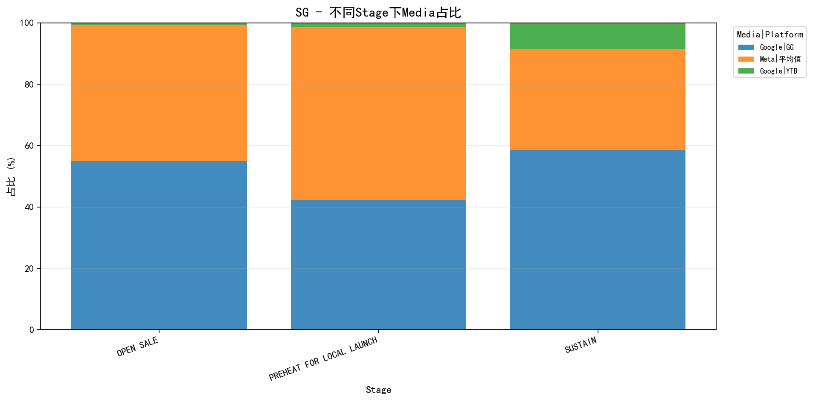

# 测试报告
**测试用例**: relaxation_trigger
**UUID**: 87735e6c-f58c-498b-a46a-c84b340a
**Job ID**: 1774606920_1_de137103
**生成时间**: 2026-03-27 18:22:44

---
## 测试配置
| 配置项 | 值 |
|--------|-----|
| KPI目标达成率 | 95% |
| 区域预算目标达成率 | 90% |
| 区域KPI目标达成率 | 80% |
| 阶段预算误差范围 | 20% |
| 营销漏斗预算误差范围 | 15% |
| 媒体预算误差范围 | 5% |
| AdFormatKPI目标达成率 | 95% |
| AdFormat预算目标达成率 | 95% |

---
### KPI优先级
| 优先级 | KPI |
|--------|-----|
| 1 | Impression |
| 2 | Clicks |
| 3 | VideoViews |

---
### 模块优先级
| 优先级 | 模块 |
|--------|-----|
| 1 | kpiInfo |
| 2 | media |
| 3 | stage |
| 4 | mediaMarketingFunnelFormat |
| 5 | mediaMarketingFunnelFormatBudgetConfig |
| 6 | marketingFunnel |

---
## 全局 KPI 达成情况
**达成率**: 1/3 (33.33%)

**判断逻辑**: 当"必须达成"为"是"时，要求实际值 ≥ 目标值；当"必须达成"为"否"时，满足达成率条件即可。

| KPI | 优先级 | 必须达成 | 实际值 | 目标值 | 达成率 | 状态 |
|-----|--------|----------|--------|--------|--------|------|
| Impression | 1 | 是 | 1,495,298,288 | 2,006,293,250 | 75.00% | ✗ 未达成 |
| Clicks | 2 | 是 | 35,441,063 | 50,541,208 | 70.00% | ✗ 未达成 |
| VideoViews | 3 | 否 | 0 | 0 | 0.00% | ✓ 达成 |

---
## 区域预算达成情况
**匹配类型**: None
**达成率**: 0/0 (N/A)

---
## 区域 KPI 达成情况

**判断逻辑**: 当"必须达成"为"是"时，要求实际值 ≥ 目标值；当"必须达成"为"否"时，满足达成率条件即可。
### 汇总
| 区域 | 达成数/总数 | 达成率 |
|------|-------------|--------|

### 详细信息

---
## 阶段预算满足情况
**总体满足率**: 3/3 (100.0%)

| 区域 | 满足数/总数 | 满足率 |
|------|-------------|--------|
| SG | 3/3 | 100.0% |

---
## 营销漏斗预算满足情况
**总体满足率**: 2/2 (100.0%)
**SG 顺序一致性**: ✓ 一致

| 区域 | 漏斗 | 目标排名 | 实际排名 | 目标预算 | 实际预算 | 目标比例 | 实际比例 | 状态 |
|------|------|----------|----------|----------|----------|----------|----------|------|
| SG | Traffic | 1 | 1 | 5,775,600 | 5,839,523 | 96.26% | 97.33% | ✓ 满足 |
| SG | Awareness | 2 | 2 | 224,400 | 160,477 | 3.74% | 2.67% | ✓ 满足 |

---
## 媒体预算满足情况
**总体满足率**: 3/3 (100.0%)

| 区域 | 满足数/总数 | 满足率 |
|------|-------------|--------|
| SG | 3/3 | 100.0% |

### 详细信息
#### SG
| 媒体 | 平台 | 目标预算 | 实际预算 | 目标比例 | 实际比例 | 误差 | 状态 |
|------|------|----------|----------|----------|----------|------|------|
| Google | GG | 3,120,000 | 3,143,457 | 52.00% | 52.39% | 0% | ✓ 满足 |
| Google | YTB | 480,000 | 160,477 | 8.00% | 2.67% | 5% | ✓ 满足 |
| Meta | 平均值 | 2,400,000 | 2,696,066 | 40.00% | 44.93% | 5% | ✓ 满足 |

---
## 不同Stage下Media占比统计
说明：按 `国家 -> stage -> media|platform` 聚合预算，并计算每个 stage 内的占比。

### SG

| Stage | Media | Platform | 预算 | 占比 |
|-------|-------|----------|------|------|
| OPEN SALE | Google | GG | 1,655,972.00 | 54.93% |
| OPEN SALE | Meta | 平均值 | 1,337,306.00 | 44.36% |
| OPEN SALE | Google | YTB | 21,454.00 | 0.71% |
| PREHEAT FOR LOCAL LAUNCH | Meta | 平均值 | 904,219.00 | 56.48% |
| PREHEAT FOR LOCAL LAUNCH | Google | GG | 675,375.00 | 42.18% |
| PREHEAT FOR LOCAL LAUNCH | Google | YTB | 21,454.00 | 1.34% |
| SUSTAIN | Google | GG | 812,110.00 | 58.67% |
| SUSTAIN | Meta | 平均值 | 454,541.00 | 32.84% |
| SUSTAIN | Google | YTB | 117,569.00 | 8.49% |

---
## adformat KPI 达成情况
**总体达成率**: 0/6 (0.0%)

| 区域 | 达成数/总数 | 达成率 |
|------|-------------|--------|
| SG | 0/6 | 0.0% |

### 详细信息
#### SG
| 媒体 | 平台 | 漏斗 | 广告格式 | 创意 | KPI | 优先级 | 必须达成 | 实际值 | 目标值 | 达成率 | 状态 |
|------|------|------|----------|------|-----|--------|----------|--------|--------|--------|------|
| Google | GG | Traffic | Demand Gen | Image | Impression | 1 | 是 | 543,832,118 | 915,261,822 | 59.00% | ✗ 未达成 |
| Google | GG | Traffic | Demand Gen | Image | Clicks | 2 | 是 | 19,102,103 | 32,148,572 | 59.00% | ✗ 未达成 |
| Google | YTB | Awareness | VRC 2.0 | Video | Impression | 1 | 是 | 14,861,460 | 24,937,491 | 60.00% | ✗ 未达成 |
| Google | YTB | Awareness | VRC 2.0 | Video | Clicks | 2 | 是 | 587,828 | 986,374 | 60.00% | ✗ 未达成 |
| Meta | 平均值 | Traffic | Image&Video Link Ads | Image&Video | Impression | 1 | 是 | 922,880,438 | 985,842,208 | 94.00% | ✗ 未达成 |
| Meta | 平均值 | Traffic | Image&Video Link Ads | Image&Video | Clicks | 2 | 是 | 14,402,063 | 15,384,615 | 94.00% | ✗ 未达成 |

---
## adformat预算满足情况
**总体满足率**: 2/4 (50.0%)

| 区域 | 满足数/总数 | 满足率 |
|------|-------------|--------|
| SG | 2/4 | 50.0% |

### 详细信息
#### SG
| 媒体 | 平台 | 漏斗 | 广告格式 | 创意 | 实际预算 | 目标预算 | 达成率 | 最小要求 | 必须达成 | 状态 |
|------|------|------|----------|------|----------|----------|--------|----------|----------|------|
| Google | GG | Traffic | Demand Gen | Image | 2,406,865 | 720,000 | 334% | 720,000 | 是 | ✓ 达成 |
| Google | GG | Traffic | Search | Text | 736,592 | 2,400,000 | 31% | 2,400,000 | 是 | ✗ 未达成 |
| Google | YTB | Awareness | VRC 2.0 | Video | 160,477 | 1,080,000 | 15% | 1,080,000 | 是 | ✗ 未达成 |
| Meta | 平均值 | Traffic | Image&Video Link Ads | Image&Video | 2,696,066 | 1,800,000 | 150% | 1,800,000 | 是 | ✓ 达成 |

---
## adformat预算非0检查

**说明**: 当 `allow_zero_budget=False` 时，检查每个推广区域下每个 AdFormat 是否都分配了预算。按 (媒体, 平台, 广告格式) 聚合求和预算，只要预算 > 0 即视为已分配。
**总体满足率**: 4/4 (100.0%)

| 区域 | 满足数/总数 | 满足率 |
|------|-------------|--------|
| SG | 4/4 | 100.0% |

✓ 所有 AdFormat 都已分配预算

---
## 总体结论

### 各维度达成情况汇总

| 维度 | 达成情况 | 达成率 |
|------|----------|--------|
| 全局 KPI | 0/2 | 0.0% |
| 区域预算 | 0/0 | 0.0% |
| 区域 KPI | 0/0 | 0.0% |
| 阶段预算 | 3/3 | 100.0% |
| 营销漏斗预算 | 2/2 | 100.0% |
| 媒体预算 | 3/3 | 100.0% |
| adformat kpi | 0/6 | 0.0% |
| adformat预算 | 2/4 | 50.0% |
| adformat预算非0 | 4/4 | 100.0% |
