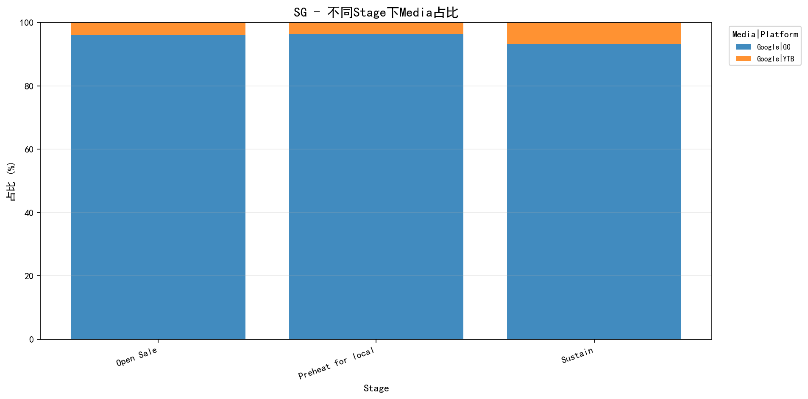

# 测试报告
**测试用例**: xiaomi_v2_media_infeasible_rerun_corporation
**UUID**: f1ad1718-abee-411d-a4a4-13369c2d
**Job ID**: 1774951846_1_6f9499b4
**生成时间**: 2026-03-31 18:12:26

---
## 测试配置
| 配置项 | 值 |
|--------|-----|
| KPI目标达成率 | 80% |
| 区域预算目标达成率 | 90% |
| 区域KPI目标达成率 | 80% |
| 阶段预算误差范围 | 20% |
| 营销漏斗预算误差范围 | 15% |
| 媒体预算误差范围 | 5% |
| AdFormatKPI目标达成率 | 100% |
| AdFormat预算目标达成率 | 100% |

---
### KPI优先级
| 优先级 | KPI |
|--------|-----|
| 1 | Impression |
| 2 | Clicks |

---
### 模块优先级
| 优先级 | 模块 |
|--------|-----|
| 1 | kpiInfo |
| 2 | media |
| 3 | marketingFunnel |
| 4 | stage |
| 5 | mediaMarketingFunnelFormat |
| 6 | mediaMarketingFunnelFormatBudgetConfig |

---
## 全局 KPI 达成情况
**达成率**: 0/2 (0.00%)

**判断逻辑**: 当"必须达成"为"是"时，要求实际值 ≥ 目标值；当"必须达成"为"否"时，满足达成率条件即可。

| KPI | 优先级 | 必须达成 | 实际值 | 目标值 | 达成率 | 状态 |
|-----|--------|----------|--------|--------|--------|------|
| Impression | 1 | 是 | 45,792,422 | 73,509,616 | 62.00% | ✗ 未达成 |
| Clicks | 2 | 否 | 0 | 655,130 | 0.00% | ✗ 未达成 |

---
## 区域预算达成情况
**匹配类型**: None
**达成率**: 0/0 (N/A)

---
## 区域 KPI 达成情况

**判断逻辑**: 当"必须达成"为"是"时，要求实际值 ≥ 目标值；当"必须达成"为"否"时，满足达成率条件即可。
### 汇总
| 区域 | 达成数/总数 | 达成率 |
|------|-------------|--------|

### 详细信息

---
## 阶段预算满足情况
**总体满足率**: 3/3 (100.0%)

| 区域 | 满足数/总数 | 满足率 |
|------|-------------|--------|
| SG | 3/3 | 100.0% |

---
## 营销漏斗预算满足情况
**总体满足率**: 2/2 (100.0%)

| 区域 | 满足数/总数 | 满足率 |
|------|-------------|--------|
| SG | 2/2 | 100.0% |

---
## 媒体预算满足情况
**总体满足率**: 0/3 (0.0%)

| 区域 | 满足数/总数 | 满足率 |
|------|-------------|--------|
| SG | 0/3 | 0.0% |

### 详细信息
#### SG
| 媒体 | 平台 | 目标预算 | 实际预算 | 目标比例 | 实际比例 | 误差 | 状态 |
|------|------|----------|----------|----------|----------|------|------|
| Google | GG | 28,640 | 54,496 | 50.00% | 95.14% | 45% | ✗ 不满足 |
| Google | YTB | 0 | 2,782 | 0.00% | 4.86% | null | ✗ 不满足 |
| Meta | 平均值 | 28,640 | 0 | 50.00% | 0.00% | 50% | ✗ 不满足 |

---
## 不同Stage下Media占比统计
说明：按 `国家 -> stage -> media|platform` 聚合预算，并计算每个 stage 内的占比。

### SG

| Stage | Media | Platform | 预算 | 占比 |
|-------|-------|----------|------|------|
| Open Sale | Google | GG | 22,398.00 | 96.03% |
| Open Sale | Google | YTB | 927.00 | 3.97% |
| Preheat for local | Google | GG | 13,816.00 | 96.39% |
| Preheat for local | Google | YTB | 518.00 | 3.61% |
| Sustain | Google | GG | 18,282.00 | 93.19% |
| Sustain | Google | YTB | 1,337.00 | 6.81% |

---
## adformat KPI 达成情况
**总体达成率**: 1/8 (12.5%)

| 区域 | 达成数/总数 | 达成率 |
|------|-------------|--------|
| SG | 1/8 | 12.5% |

### 详细信息
#### SG
| 媒体 | 平台 | 漏斗 | 广告格式 | 创意 | KPI | 优先级 | 必须达成 | 实际值 | 目标值 | 达成率 | 状态 |
|------|------|------|----------|------|-----|--------|----------|--------|--------|--------|------|
| Google | GG | Traffic | Demand Gen | Image/Video | Impression | 1 | 否 | 44,206,350 | 48,571,429 | 91.00% | ✗ 未达成 |
| Google | GG | Traffic | Demand Gen | Image/Video | Clicks | 2 | 否 | 0 | 485,714 | 0.00% | ✗ 未达成 |
| Google | GG | Traffic | Search | Text | Impression | 1 | 否 | 1,586,072 | 723,214 | 219.00% | ✓ 达成 |
| Google | GG | Traffic | Search | Text | Clicks | 2 | 否 | 0 | 57,857 | 0.00% | ✗ 未达成 |
| Google | YTB | Awareness | VRC 2.0 | Video | Impression | 1 | 否 | 0 | 1,190,476 | 0.00% | ✗ 未达成 |
| Google | YTB | Awareness | VRC 2.0 | Video | Clicks | 2 | 否 | 0 | 613 | 0.00% | ✗ 未达成 |
| Meta | 平均值 | Traffic | Traffic | Image/Video | Impression | 1 | 否 | 0 | 10,456,731 | 0.00% | ✗ 未达成 |
| Meta | 平均值 | Traffic | Traffic | Image/Video | Clicks | 2 | 否 | 0 | 110,946 | 0.00% | ✗ 未达成 |

---
## adformat预算满足情况
**总体满足率**: 2/4 (50.0%)

| 区域 | 满足数/总数 | 满足率 |
|------|-------------|--------|
| SG | 2/4 | 50.0% |

### 详细信息
#### SG
| 媒体 | 平台 | 漏斗 | 广告格式 | 创意 | 实际预算 | 目标预算 | 达成率 | 最小要求 | 必须达成 | 状态 |
|------|------|------|----------|------|----------|----------|--------|----------|----------|------|
| Google | GG | Traffic | Demand Gen | Image/Video | 27,850 | 29,143 | 96% | 29,143 | 否 | ✗ 未达成 |
| Google | GG | Traffic | Search | Text | 26,646 | 11,571 | 230% | 11,571 | 否 | ✓ 达成 |
| Google | YTB | Awareness | VRC 2.0 | Video | 2,782 | 2,143 | 130% | 2,143 | 否 | ✓ 达成 |
| Meta | 平均值 | Traffic | Traffic | Image/Video | 0 | 14,423 | 0% | 14,423 | 否 | ✗ 未达成 |

---
## adformat预算非0检查

**说明**: 当 `allow_zero_budget=False` 时，检查每个推广区域下每个 AdFormat 是否都分配了预算。按 (媒体, 平台, 广告格式) 聚合求和预算，只要预算 > 0 即视为已分配。
**总体满足率**: 3/4 (75.0%)

| 区域 | 满足数/总数 | 满足率 |
|------|-------------|--------|
| SG | 3/4 | 75.0% |

### SG - 未满足的 AdFormat
| 媒体 | 平台 | 广告格式 | 预算 |
|------|------|----------|------|
| Meta | 平均值 | Traffic | 0.00 |

---
## 总体结论

### 各维度达成情况汇总

| 维度 | 达成情况 | 达成率 |
|------|----------|--------|
| 全局 KPI | 0/2 | 0.0% |
| 区域预算 | 0/0 | 0.0% |
| 区域 KPI | 0/0 | 0.0% |
| 阶段预算 | 3/3 | 100.0% |
| 营销漏斗预算 | 2/2 | 100.0% |
| 媒体预算 | 0/3 | 0.0% |
| adformat kpi | 1/8 | 12.5% |
| adformat预算 | 2/4 | 50.0% |
| adformat预算非0 | 3/4 | 75.0% |
